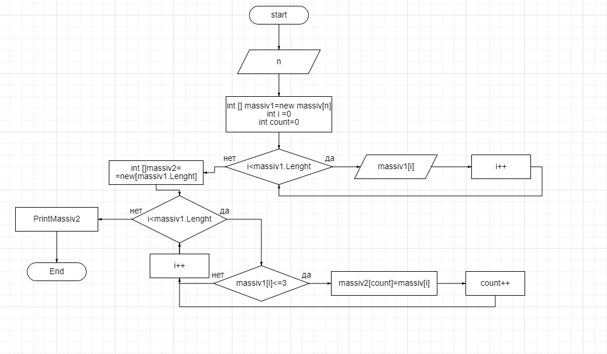

Условия задачи.
==============
Написать программу, которая из имеющегося массива строк формирует новый массив из строк, длина которых меньше, либо равна 3 символам. Первоначальный массив можно ввести с клавиатуры, либо задать на старте выполнения алгоритма. При решении не рекомендуется пользоваться коллекциями, лучше обойтись исключительно массивами.

Примеры.
=======
[“Hello”, “2”, “world”, “:-)”] → [“2”, “:-)”] [“1234”, “1567”, “-2”, “computer science”] → [“-2”] [“Russia”, “Denmark”, “Kazan”] → []

Алгоритм.
=========
* Запрашиваем количество элементов в базовом массиве и вводим его через консоль.
* Подсчитываем количество элементов нужной длинны и создаем новый массив с полученным количеством элементов.
* Перебираем элементы базового массива, каждый элемент проверяем на соответствие условию, если подходит, копируем в результирующий массив.

